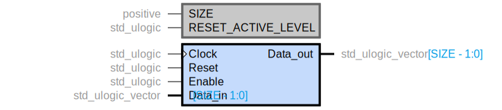

# HDLTree

HDLTree is a pure Python HDL parser that uses [Lark](https://github.com/lark-parser/lark) to create a parse tree, then transform it into a syntax tree. Currently only VHDL-2008 is supported.

The HDLTree repo also includes the [Hdlparse](https://github.com/kevinpt/hdlparse) and [Symbolator](https://github.com/kevinpt/symbolator) packages, originally written by [kevinpt](https://github.com/kevinpt). This repo is based on a [fork](https://github.com/zebreus/symbolator) maintained by [zebreus](https://github.com/zebreus) which consolidated the two packages and applied several patches. The version of Hdlparse in this repo has been rewritten to use HDLTree for parsing VHDL instead of the simple partial parser in the original. Verilog is still handled by the original parser, until such time as HDLTree supports parsing Verilog.

Included with Symbolator are the symbolator_sphinx package for embedding symbolator symbols in Sphinx documentation, and the nucanvas package as a wrapper around Pycairo and PyGObject.

## Getting HDLTree

### Prerequisites

HDLTree and Hdlparse don't have any dependencies besides python packages automatically installed by pip. Symbolator requires Cairo and Pango. On Linux, these are likely packaged by your distribution and can be installed with pacman, apt-get, dnf, etc. On Windows, the best way is probably to install [GTK](https://www.gtk.org/docs/installations/windows/).

### Installing releases from pip

HDLTree is available on [PyPI](https://pypi.org/project/hdltree/):

```sh
pip install hdltree
```

### Installing from latest source

The GitHub repo may be ahead of the released package. You can install the bleeding edge version:

```sh
pip install git+https://github.com/rpatel3001/hdltree.git
```

### Extra Dependencies

#### Symbolator Dependencies

Symbolator requires the pygobject and pycairo packages as bindings for Cairo and Pango.

```sh
pip install hdltree[symbolator]
```

#### Regex Library

[Lark](https://lark-parser.readthedocs.io/en/stable/classes.html#using-unicode-character-classes-with-regex) can use the regex library instead of the builtin re library for regular expressions. HDLTree will automatically use the regex library if it is installed.

```sh
pip install hdltree[regex]
```

### CLI Scripts

After a successful install the `hdltree`, `hdlparse`, and `symbolator` executables will be available. On Linux they should be immediately accessible on your $PATH. On Windows you may need to add the `<Python root>\Scripts` directory to your %PATH%.

The `hdltree` and `hdlparse` scripts are not particularly useful for end use. `hdltree` will print the syntax tree for the input files. `hdlparse` will print the parsed information from a fixed piece of code. `symbolator` is the only one meant to be used primarily from a terminal and its use is described [below](#symbolator).

## Usage

Coming soon. For now, see [an example](examples/example.py) that parses input files, generates a Graphviz/DOT based symbol as an alternative to symbolator, and compares the input file to a recreation from the syntax tree for equivalency (minus comments and whitespace).

## Hdlparse

Hdlparse is a simple package implementing a rudimentary parser for VHDL and Verilog. It is not capable of fully parsing the entire language. Rather, it is meant to extract enough key information from a source file to create generated documentation.

For VHDL this library can extract component, subprogram, type, subtype, and constant declarations from a package. For Verilog it can extract module declarations (both 1995 and 2001 syntax). Because this version of Hdlparse replaces the VHDL parser with HDLTree, it's behavior may not exactly match other versions of Hdlparse for VHDL files. One restriction is that input files must be full, valid VHDL files. Partial files with bare component or entity declarations are not supported.

Full documentation can be found at [here](http://kevinpt.github.io/hdlparse/).

## Symbolator

Symbolator is a component diagramming tool for VHDL and Verilog. It will parse HDL source files, extract components or entities and render them as an image.

Full documentation can be found [here](https://zebreus.github.io/symbolator/). Due to limitations of the Lark based parser, symbol sections defined in metacomments are not supported by this version of symbolator.

```vhdl
library ieee;
use ieee.std_logic_1164.all;

package demo is
  component demo_device_comp is
    generic (
      SIZE : positive;
      RESET_ACTIVE_LEVEL : std_ulogic := '1'
    );
    port (
      Clock : in std_ulogic;
      Reset : in std_ulogic;

      Enable : in std_ulogic;
      Data_in : in std_ulogic_vector(SIZE-1 downto 0);
      Data_out : out std_ulogic_vector(SIZE-1 downto 0)
    );
  end component;
end package;
```

```console
$ symbolator -i docs/images/demo_device.vhdl
Created demo_device_comp.svg from demo_device_comp (docs/images/demo_device.vhdl)
```

Produces the following:



Symbolator can render to PNG bitmap images or SVG, PDF, PS, and EPS vector images. SVG is the default.
